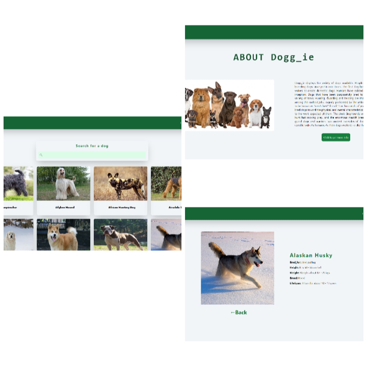

<div id="top"></div>
<div align="center">
    
</div>
<h1  align="center" >Dogg_ie Web App</h1>
<!-- TABLE OF CONTENTS -->
<details>
  <summary>Table of Contents</summary>
  <ol>
    <li>
      <a href="#about-the-project">About The Project</a>
        <ul>
            <li><a href="#overview">Overview</a></li>
            <li><a href="#built-with">Built With</a></li>
            <li><a href="#getting-started">Getting Started</a></li>
            <li><a href="#available-script">Available Script</a></li>
            <li><a href="#dependencies">Dependencies</a></li>
        </ul>
    </li>      
  </ol>
</details>


## About The Project

This web app was created to allow users to search for dogs they like.

**Features**


```
1.The ability to navigate from the home page and to the about page.
2.An input to search for cocktails-drinks.
3.A button that, when clicked, takes the user to get more information about dog.
```

## Overview

* [Repo Codes](https://github.com/ijayhub/dog-web-app)

* [Hosted Link](https://dog-web-app.netlify.app/)


<p align="right">(<a href="#top">back to top</a>)</p>

### Built With

* [React.js](https://reactjs.org/)

* [Tailwind css](https://tailwindcss.com/)

* [vite](https://vitejs.dev/guide/#scaffolding-your-first-vite-project)

* [API](https://thedogapi.com/)


<p align="right">(<a href="#top">back to top</a>)</p>

## Getting Started


To get a local copy up and running follow these simple example steps:
## Available Script

In the project directory, you can run:

 ### `npm run dev`

Runs the app in the development mode.

Open [http://localhost:3000](http://localhost:3000) to view it in your browser.

The page will reload when you make changes.

You may also see any lint errors in the console.

<p align="right">(<a href="#top">back to top</a>)</p>

### Dependencies
[npm react-router-dom@6](https://reactrouter.com/docs/en/v6/getting-started/installation)

<p align="right">(<a href="#top">back to top</a>)</p>

 - Not yet done with the app

